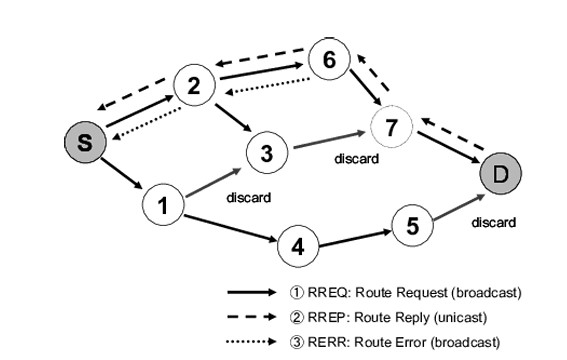

# Ad-hoc On-demand Distance Vector

**Overview**

AODV (Ad-hoc On-demand Distance Vector) is a reactive routing protocol designed for dynamic ad-hoc networks. Its adaptability and scalability make it a popular choice compared to other routing protocols in these environments.

When a source node needs to send data to a destination node, it first checks its routing table for a valid route. If one exists, the routing process proceeds. Otherwise, AODV initiates an on-demand route discovery mechanism, making it a reactive protocol.

**Key Processes**

AODV primarily relies on two key processes:

- **Route Discovery:**
    - Nodes initiate route discovery by broadcasting an RREQ (Route Request) message to their neighbors.
    - If a receiving node lacks a route to the destination, it forwards the RREQ to its neighbors while keeping track of a reverse route to the requesting node for sending future responses.
    - This process continues until the RREQ reaches a node with a valid route to the destination (which could be the destination itself).
    - This node unicasts an RREP (Route Reply) message back to the source, traversing along the reverse routes established by intermediate nodes.
    - This establishes a bidirectional route between the source and destination.
- **Route Maintenance:**
    - Each node maintains a routing table containing entries for destinations. 
    - These entries include three crucial fields:
        - **Next Hop:** The next node on the path to the destination.
        - **Sequence Number:** A time-stamp indicating route freshness.
        - **Hop Count:** The current distance (number of hops) to the destination.
    - Packets destined for a particular destination are sent to the next hop specified in the routing table.
    - Sequence numbers help determine the most recent and reliable route, while hop counts provide an estimate of the distance to the destination.
    - When a node loses connection with its next hop, it invalidates the route by sending an RERR (Route Error) message to nodes that potentially received its RREP.
    - Duplicate RREQ requests are prevented by checking for them at each node in the network.

  

**Requirements:**
Contiki OS and Cooja Emulator.  

**Code Description: AODV with Protothreads**

This AODV implementation utilizes four protothreads to handle core functionalities:

**Protothreads:**

- **Establish Connection (est_conn)**
    - Initializes routing table entries and connections for all nodes.
    - Uses `PROCESS_EXITHANDLER` to close unicast and broadcast channels upon termination.
    - Opens channels for sending routing requests, replies, and data to initiate AODV routing.

- **Data Packet (data_pck)**
    - Assigns destination and uploads payload packets from source to destination.
    - Destination can be random or specific within the network size.
    - Checks next node and route availability before sending data (unicast) using `fwddata()`.
    - If the route is unavailable:
        - Copies data to a temporary discovery table structure.
        - Pushes data into a queue as part of a route request.
        - Posts the process to the Route Request protothread (`rreq_pck`).
        - Increments an entry number.

- **Route Request (rreq_pck)**
    - Broadcasts RREQ packets from source to destination.
    - Updates the current node's discovery table with source, destination, and other entries using `updtDisc()`.
    - This update facilitates backward learning for route traceability.
    - This process is triggered when the source-to-destination route is not available in the routing table generated by `data_pck`.

- **Sequence (seqno)**
    - Checks routing and discovery tables, removing expired entries.
    - Uses a monotonically increasing sequence number for route validity.
    - In this project, the maximum limit is set to 120.
    - When the count reaches its maximum, the route is removed, indicating the route request to a node has expired.
    - Applies the same logic to the discovery table to remove expired routes.

**Code Description: Callback Functions**

- **broadcast_rreq()**: This callback function receives a broadcasted RREQ message.
    - If the destination node in the RREQ matches the current node, the route request structure elements are copied to the route reply structure elements.
    - The route reply is then unicasted using the `fwdrrep()` function.
    - `dupReq()` checks for duplicate RREQ requests.
    - Non-duplicate and non-destination RREQ messages are copied and posted to the `rreq_pck` (Route Request) process.
    - Duplicate RREQ messages are simply dropped.
- **unicast_rrep()**: This callback function receives a unicast RREP message.
    - It checks the routing table and updates it if a route with a lower hop count is found.
    - If the source and current node are not the same, the hop count is incremented, and the discovery table is updated (if the route is active).
    - The RREP is forwarded to the adjacent node using the `fwdrrep()` function.
    - Regardless of source and current node match, the backward source traceability path in the discovery table is cleared using the `clrDisc()` function.
- **unicast_data()**: This callback function receives a unicast data packet.
    - It is called in response to the `fwddata()` function.
    - If the destination node matches the current node, the received data is acknowledged.
    - Otherwise, the control is posted to the `data_pck` protothread for further processing.

**Other Functions**

- `fwdrreq()`, `fwdrrep()`, and `fwddata()` functions: These functions are used to copy data using `packetbuf_copyfrom()`, and broadcast or unicast the data packets, respectively.

**Implementation of AODV**

This implementation utilizes two approaches:

**1. Using broadcast function:**

- Route Error (RERR) handling
- Continuous broadcast selecting random destinations
- Broadcast on a button click with a fixed destination

**2. Using netflood function:**

**Future Enhancement:**

The concept of selecting the strongest link between the Networked sensor nodes can be implemented as a part of enhancement using RSSI and LQI readings 
using the neighbour table concepts and `packetbuf_attr()` Contiki functions. 

